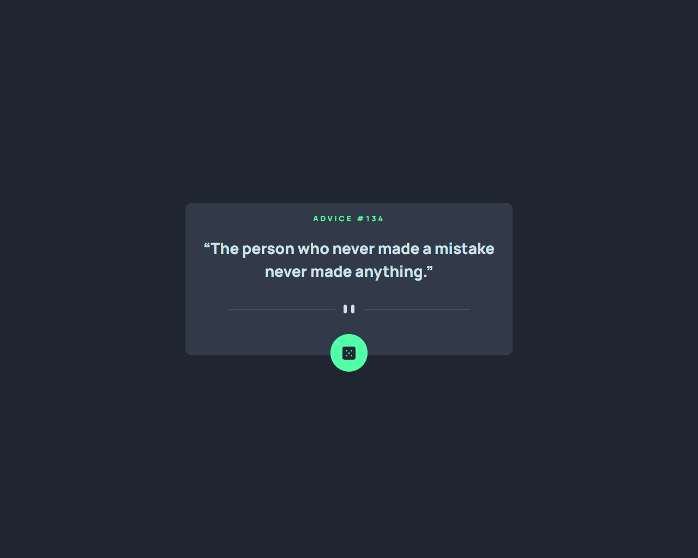
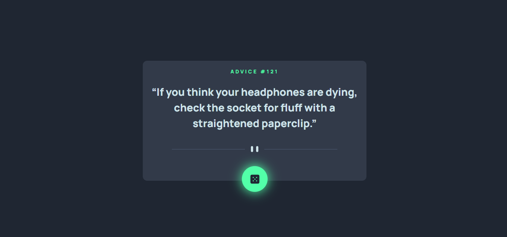
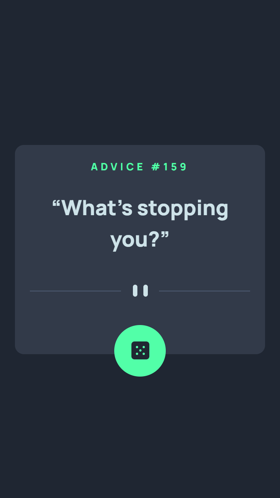
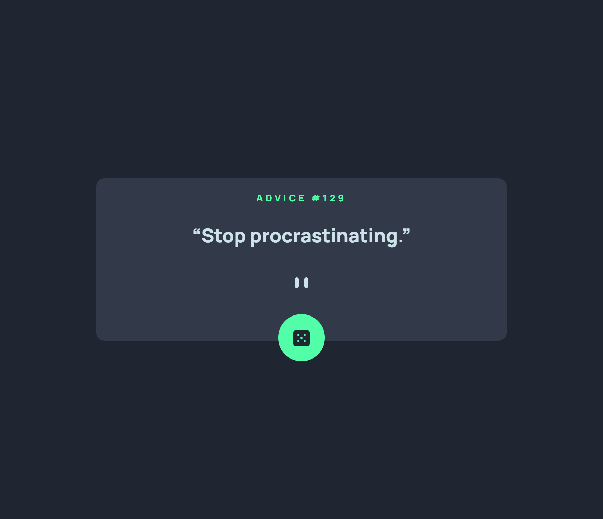

# Frontend Mentor - Advice generator app solution

This is a solution to the [Advice generator app challenge on Frontend Mentor](https://www.frontendmentor.io/challenges/advice-generator-app-QdUG-13db). Frontend Mentor challenges help you improve your coding skills by building realistic projects.

## Table of contents

- [Overview](#overview)
  - [The challenge](#the-challenge)
  - [Screenshot](#screenshot)
  - [Links](#links)
- [My process](#my-process)
  - [Built with](#built-with)
  - [What I learned](#what-i-learned)
  - [Continued development](#continued-development)
- [Author](#author)

## Overview

### The challenge

Users should be able to:

### Screenshot

### Links

- Solution URL: [Solution URL](https://github.com/nehanalinik/advice-generator-react)
- Live Site URL: [Live site URL ](https://nehanalinik.github.io/advice-generator-react/)

## My process

### Built with

- Semantic HTML5 markup
- CSS custom properties
- Flexbox
- Mobile-first workflow
- [React](https://reactjs.org/) - JS library
- API used - [Advice Slip API](https://api.adviceslip.com/)

### What I learned

Great learning on React API calls using fetch api and using async/await function

### Continued development

I would love to learn more about how to use Sass with React and continue my learning on React with more complex projects. Looking forward to complete projects on React

## Author

- Frontend Mentor - [@nehanalinik](https://www.frontendmentor.io/profile/nehanalinik)
- Twitter - [@KennedyNalini](https://twitter.com/KennedyNalini)
